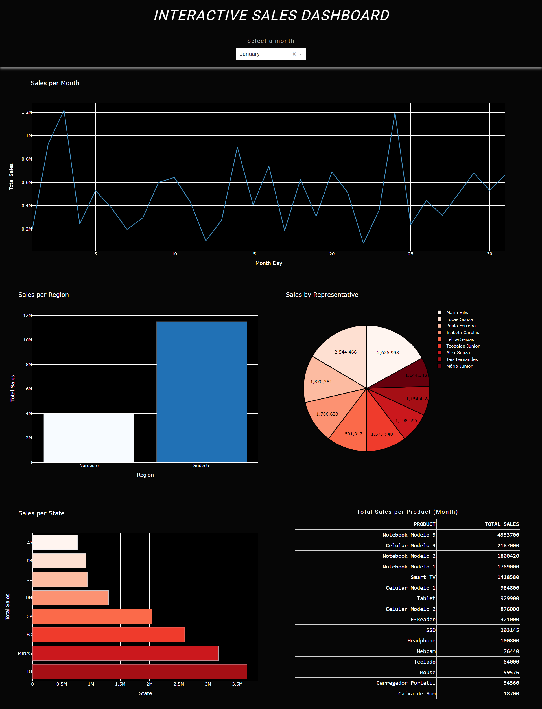

# *Sales Dashboard*

> **Objective**

The dashboard was created with the aim of representing the monitoring of a company's sales per month.

> **Libraries Used**

This dashboard was made with:
- Plotly
- Dash
- Dash Bootstrap Components
- Pandas
- Numpy

<br>

# Dash Preview



<br>

# Running

Follow the steps below to run the project on your local machine.

### 1. Clone the Repository

```bash
git clone https://github.com/jpedrou/sales-dashboard.git
```

### 2. Navigate to the Project Directory

```bash
cd sales-dashboard
```

### 3. Install Dependencies

```bash
pip install -r requirements.txt
```

### 4. Run the Project
After installing all dependencies, run the project. If there are specific instructions on how to start the Dash application, follow them. Otherwise, look for a Python file like app.py or server.py and execute it:

```bash
python dashboard.py
```

### 5. Access the Application
Open a web browser and visit the address provided in the console, usually something like:

```bash
http://localhost:8050/
```